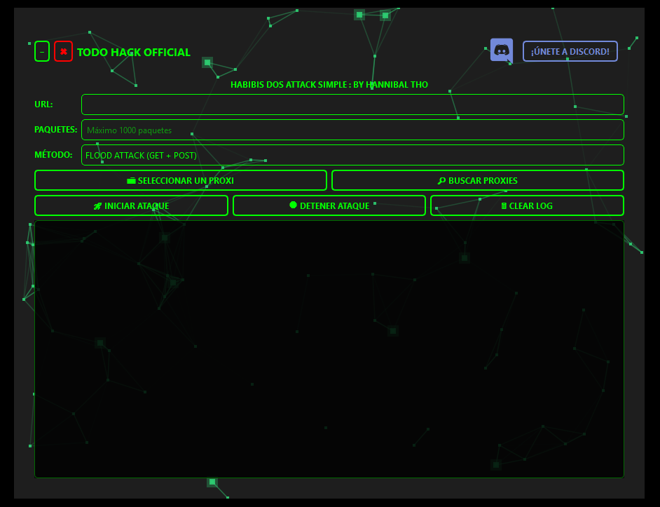

<p align="center">
  
</p>

# 🚀 THO HABIBIS DDOS ATTACK TOOL

[](https://discord.gg/Zcq7GD3FFH)
[](https://www.youtube.com/watch?v=fb_-q2-teNA&ab_channel=TODOHACKOFFICIAL)

Una herramienta de DDoS con interfaz gráfica que incluye múltiples métodos de ataque y bypass.



## 🎥 Demostración

<p align="center">
  
</p>

## ⚡ Características

- 🎯 6 métodos diferentes de ataque
- 🔄 Rotación automática de proxies
- 🛡️ Bypass para Cloudflare y WAF
- 🖥️ Interfaz gráfica moderna y interactiva
- 📊 Consola de logs en tiempo real
- 🚀 Maximo de paquetes 1000

## 📥 Instalación

### Requisitos previos

```bash
 Instalar Python 3.8 o superior
 Instalar Git (opcional)
```

### Pasos de instalación

1. Clonar el repositorio o descargar como ZIP:
```bash
git clone https://github.com/HANNIBAL-THO/HABIBIS-DDOS-ATTACK.git
cd HABIBIS-DDOS-ATTACK
```

2. Instalar dependencias:
```bash
pip install -r requirements.txt
```

## 🚀 Uso

1. Ejecutar el script:
```bash
python "THO DDOS WEB.pyw"
```

2. Ingresar la URL objetivo
3. Seleccionar número de paquetes (threads)
4. Elegir método de ataque
5. Cargar/Buscar proxies
6. Iniciar ataque

## 🔨 Compilar a EXE

1. Instalar pyinstaller:
```bash
pip install pyinstaller
```

2. Compilar el script:
```bash
pyinstaller --onefile --icon=assets/icon.ico --noconsole "THO DDOS WEB.py"
```

3. El ejecutable se generará en la carpeta `dist`

## 🛠️ Métodos de Ataque

- **FLOOD ATTACK**: Combina GET+POST para saturar el servidor
- **BYPASS ATTACK**: Utiliza HEAD+GET para evadir protecciones
- **PROXY ROTATION**: Rota proxies para evitar bloqueos
- **CLOUDFLARE BYPASS**: Evasión específica para Cloudflare
- **CACHE BYPASS**: Ataque a la caché del servidor
- **WAF EVASION**: Bypass de Web Application Firewalls

## ⚠️ Aviso Legal

Esta herramienta es solo para propósitos educativos. El mal uso puede ser ilegal.

## 🔗 Links

- [Discord](https://discord.gg/4svwzsy3UP)
- [YouTube](https://www.youtube.com/watch?v=fb_-q2-teNA&ab_channel=TODOHACKOFFICIAL)

## 📝 Requisitos

```txt
pyside6
requests
urllib3
```

## 📜 Licencia

Distribuido bajo la licencia MIT. Ver `LICENSE` para más información.
